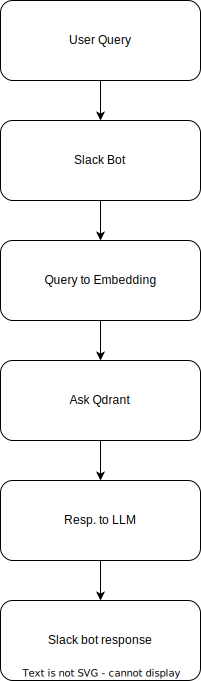

# Problem we are solving
Slack bot that answers questions contextually from the information available across recorded and published DevDay talks.

# How we chose tools for this bot?

1. Easy to understand/use
2. Less code/maintenance
3. Cheap to run

# Data processing flow

# Slack bot flow

